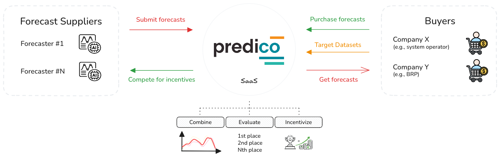

<!-- markdownlint-disable MD033 MD041 -->

<p align="center">
  
</p>

<h1 align="center">Predico Forecast Engine</h1>

<p align="center">
  <strong>Ensemble forecasting algorithms for collaborative renewable energy prediction</strong>
</p>

<p align="center">
  <a href="https://www.python.org/downloads/"></a>
  <a href="LICENSE"></a>
  <a href="https://predico.inesctec.pt/docs/"></a>
  <a href="https://github.com/astral-sh/ruff"></a>
  <a href="https://python-poetry.org/"></a>
  <a href="https://github.com/INESCTEC/predico-collabforecast/commits/"></a>
  <a href="https://github.com/INESCTEC/predico-collabforecast/stargazers"></a>
  <a href="https://github.com/INESCTEC/predico-collabforecast/issues"></a>
</p>

---

## What is Predico?

**Predico** is a collaborative forecasting platform, built by INESC TEC Centre for Power and Energy Systems (CPES), for energy time-series forecasting.

<p align="center">
  
</p>


It improves accuracy and robustness by **combining forecasts from multiple suppliers** using **ensemble methods**, rather than relying on a single model or vendor.
Check the [Official Platform Website](https://predico.inesctec.pt) for more details.

---

## What is in this repository?

This repository contains the **Forecast Engine**, the core algorithmic layer of Predico that:

1. **Orchestrates forecasting sessions** (a.k.a. *market sessions*)
2. **Runs ensemble strategies** to combine individual forecasts
3. **Scores forecast quality** with multiple metrics
4. Provides a **standalone simulator** to develop and benchmark strategies locally

> [!IMPORTANT]
> Predico follows an **open core** approach. This repository contains exclusively the **open-source Forecast Engine**, that supports the full Predico platform (RESTful API, Web UI, marketplace features). [Contact us](#contacts) for more details.

---

## Project Status

This project is currently **in development**. Core functionalities are working, but improvements are ongoing.
The available base ensemble strategies and scoring mechanisms are production-ready while experimental features (e.g., advanced ensemble strategies, forecast contribution) are under active development and testing.

---

## Releases

See the [Releases page](https://github.com/INESCTEC/predico-collabforecast/releases) for version history, changelogs, and downloadable snapshots.

---

## Technology Stack

| Category | Technologies |
|----------|--------------|
| **Language** | Python 3.12+ |
| **ML & Data** | scikit-learn, pandas, NumPy, joblib |
| **Outlier Detection** | DTAIDistance (Dynamic Time Warping) |
| **Database** | SQLAlchemy, psycopg2 (PostgreSQL) |
| **CLI** | Python Fire |
| **Logging** | Loguru |
| **Progress** | tqdm |
| **Package Management** | Poetry |

---

## Dependencies

This project requires **Python 3.12+**. All dependencies are managed via `pyproject.toml`, with Poetry.

Install Poetry (if not already installed), via `pip install poetry` or see [Poetry Installation Guide](https://python-poetry.org/docs/#installation). 

Then, install all dependencies with `poetry install`.

---

## Repository structure

```text
.
├── src/
│   ├── strategies/        # Ensemble algorithms
│   ├── features/          # Feature engineering (lags, diversity metrics, rolling stats)
│   ├── assessment/        # Scoring metrics (RMSE, Pinball Loss, Winkler)
│   ├── market/            # Session orchestration and forecaster management
│   ├── io/                # Database and API I/O helpers
│   ├── core/              # Interfaces, configuration, exceptions
│   └── MarketController.py  # Production orchestration (session lifecycle)
├── simulator/
│   └── community/         # Public simulator for strategy development
├── tests/                 # Unit tests (pytest)
│   ├── strategies/        # Strategy-specific tests
│   ├── features/          # Feature engineering tests
│   ├── assessment/        # Scoring tests
│   └── validation/        # Data validation tests
├── tasks.py               # Fire CLI for production market session loop
└── conf/                  # Configuration settings
```

> [!TIP]
> See **`src/strategies/README.md`** for available strategies and how to add new ones.

---

## A simulator?

This repository includes a **standalone forecasting simulator** to facilitate the development, testing, and benchmarking of ensemble strategies without requiring access to the full Predico platform (API, database, etc.).

> [!TIP]
> A complete guide to using the Community Simulator is available in the `simulator/community/README.md`


```bash
# Navigate to the community simulator
cd simulator/community/

# Generate synthetic datasets with configurable forecaster behaviors
# (interactive wizard — use 'quickstart' for a non-interactive alternative)
python simulate.py generate_dataset

# Or run a quick non-interactive demo
python simulate.py quickstart

# Run simulations and compare strategies
python simulate.py run --strategies="weighted_avg,median"

# Visualize results
python simulate.py plot output/<dataset>/<timestamp>/
```

---

## Quick start (local simulator)

Predico's **community simulator** allows you to develop and test ensemble forecasting strategies locally, without needing access to the full platform backend.


```bash
# Clone the repository
git clone https://github.com/INESCTEC/predico-collabforecast.git
cd predico-collabforecast

# Install dependencies
poetry install

# Run a quick simulation
cd simulator/community
poetry run python simulate.py quickstart
```

> [!NOTE]
> You can also activate the virtual environment with `poetry shell` and then run commands directly (e.g., `python simulate.py quickstart`). Using `poetry run` is recommended as a single-step alternative.

This generates a synthetic dataset, with predefined forecaster supplier archetypes, and runs a simulation to demonstrate how ensembles can outperform individual predictors.

---

## Create a custom strategy

You can easily add your own ensemble forecasting strategies.

First, add your strategy code in [`src/strategies/`](src/strategies/), following the existing structure.
In this example, we create a simple averaging strategy, leveraging on our `SimpleStrategy` base class.


```python
# src/strategies/my_strategy.py
from src.strategies import SimpleStrategy, StrategyRegistry

@StrategyRegistry.register("my_strategy")
class MyStrategy(SimpleStrategy):
    @property
    def name(self) -> str:
        return "my_strategy"

    def combine(self, forecasts, **kwargs):
        # forecasts: pandas.DataFrame, rows=time, columns=forecasters
        return forecasts.mean(axis=1)
```

Then, import your strategy in [`src/strategies/__init__.py`](src/strategies/__init__.py) so the `@register` decorator is triggered at load time:

```python
# src/strategies/__init__.py
from .my_strategy import MyStrategy  # This import triggers @register

__all__ = [
    # ... Other strategy imports ...
    "MyStrategy",
]
```

Finally, run the community simulator using your new strategy:

```bash
cd simulator/community
python simulate.py run --strategies="my_strategy" --n_sessions=10
```

---
## Relevant Documentation

| Resource | Description |
|----------|-------------|
| [`simulator/community/README.md`](simulator/community/README.md) | Getting started with local simulations |
| [`src/strategies/README.md`](src/strategies/README.md) | Available algorithms + how to create new ones |
| [`simulator/community/docs/strategy-guide.md`](simulator/community/docs/strategy-guide.md) | Step-by-step strategy development |
| [`simulator/community/docs/advanced-strategies.md`](simulator/community/docs/advanced-strategies.md) | Advanced base classes and techniques |
| [`simulator/community/docs/cli-reference.md`](simulator/community/docs/cli-reference.md) | CLI options |
| [`simulator/community/docs/dataset-format.md`](simulator/community/docs/dataset-format.md) | Input data specifications |
| [`simulator/community/docs/evaluation-metrics.md`](simulator/community/docs/evaluation-metrics.md) | RMSE, Pinball Loss, Winkler scoring |

For platform integration and API documentation: **https://predico.inesctec.pt/docs/**

---

## Architecture Diagrams

Below is an overview of the main components and data flow within the Predico Forecast Engine.
Besides the ensemble strategies, Predico also includes modules for outlier detection, feature engineering, session management, and scoring.

<p align="center">
  
</p>

---

## Known Issues

No major issues are currently documented. For bug reports or feature requests, please open an issue in the repository or contact the maintainers.

---

## Contributing

Contributions are welcome (strategies, metrics, docs, tests).  If you add a new strategy, include:
- A minimal unit test (see `tests/`)
- A short note about your strategy in [`src/strategies/README.md`](src/strategies/README.md)

**Running Tests:**

```bash
poetry run pytest
```

See INESC TEC's [Contributing Guidelines](https://github.com/INESCTEC/.github/blob/main/documents/contributing.md) for more details on how to contribute.

---

## Community Standards

This project follows the INESC TEC organisation-wide governance documents:

- [Code of Conduct](https://github.com/INESCTEC/.github/blob/main/documents/code_of_conduct.md)
- [Contributing Guidelines](https://github.com/INESCTEC/.github/blob/main/documents/contributing.md)
- [Reporting Template](https://github.com/INESCTEC/.github/blob/main/documents/reporting_template.md)
- [Security Policy](https://github.com/INESCTEC/.github/blob/main/documents/security.md)

Please review these documents before contributing to the project.

---

## Credits and Acknowledgements

This project is developed and maintained by [INESC TEC](https://www.inesctec.pt/).

---

## License

Licensed under the **GNU Affero General Public License v3.0 (AGPL-3.0)**.

- See: `LICENSE`
- Commercial licensing is available — contact INESC TEC Technology Licensing Office: **info.sal@inesctec.pt**

---

## Contacts

- José Andrade — jose.r.andrade@inesctec.pt
- André Garcia — andre.f.garcia@inesctec.pt
- Carla Gonçalves — carla.s.goncalves@inesctec.pt
- Ricardo Bessa — ricardo.j.bessa@inesctec.pt

<!-- markdownlint-enable MD033 MD041 -->
