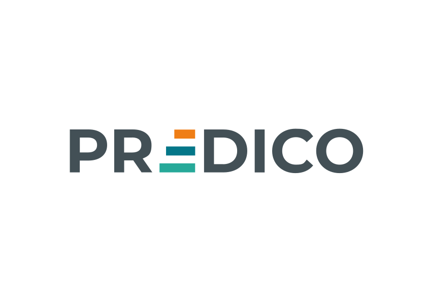
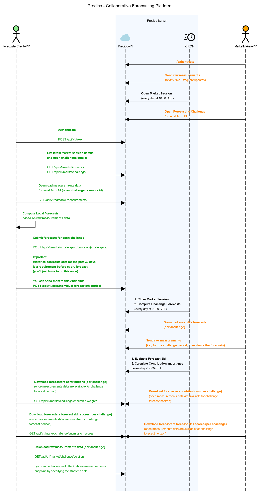

# Predico-Collabforecast: A Collaborative Forecasting Platform

[]()
[]()

<div align="left">
  
</div>

---

## Table of Contents

1. [Introduction](#1-introduction)
   - [Definitions / Nomenclature](#11-definitions--nomenclature)
   - [Collaborative Forecasting Sessions](#12-collaborative-forecasting-sessions)
   - [Service Components](#13-service-components)
2. [Project Structure](#2-project-structure)
3. [Getting Started](#3-getting-started)
   - [Prerequisites](#31-prerequisites)
   - [Environment Variables](#32-environment-variables)
   - [Environment Variables](#33-environment-variables)
4. [Production Deployment](#4-production-deployment)
   - [Start Docker Containers Stack](#41-start-docker-containers-stack)
   - [Configure Service Super User](#42-configure-service-super-user)
   - [Using the Command Line Interface (CLI)](#43-using-the-command-line-interface-cli)
5. [Development Mode](#5-development-mode)
6. [Contributing](#6-contributing)
   - [Reporting Issues](#61-reporting-issues)
7. [License](#7-license)
8. [Contacts](#8-contacts)

## 1. Introduction

Collabforecast is a backend service designed to facilitate collaborative forecasting. It is built within INESC TEC "Predico" innitiative to support the development of a data market and collaborative forecasting platform.
It provides a platform where market participants can collaboratively generate forecasts by contributing their individual predictions. 

Our approach leverages on collective intelligence to improve forecast accuracy and offers a transparent and fair mechanism for participants to benefit from their contributions.


### 1.1. Definitions / Nomenclature

   - **Market Maker**: An entity that owns resources (e.g., wind farms) or manages a grid (e.g., a Transmission System Operator) and seeks forecasts by opening and funding collaborative forecasting market sessions.
   - **Forecaster**: An individual or organization registered on the platform, aiming to submit forecasts to collaborative forecasting challenges opened by the Market Maker, competing for the available prize money in each session.
   - **Market Session**: A specific period during which Market Makers can create forecasting challenges, and Forecasters can submit forecasts for the open challenges.
   - **Market Challenge**: An opportunity, published by the Market Maker, with metadata regarding a forecasting challenge that Forecasters can submit forecasts for.
   - **Gate Closure Time**: The deadline by which forecasts must be submitted for a market session.
   - **Forecast Variables**: Quantities to be forecasted. Currently, only quantile 10, 50, and 90 forecasts are accepted.
   - **Ensemble Forecast**: An aggregate forecast computed from multiple Forecasters’ submissions.

### 1.2. Collaborative Forecasting Sessions

A collaborative forecasting session is organized in four phases:

1. **Phase 1**: A new market session is scheduled to open.
2. **Phase 2**: Market Makers post new challenges, such as submitting day-ahead forecasts for specific assets (resources) in their portfolio.
3. **Phase 3**: Forecasters log into the Collabforecast API, download raw measurement data, build their models, and submit forecasts.
4. **Phase 4**: Forecasters log into the Collabforecast API, preview their skill scores and contribution importance to the final ensemble forecasts, which are delivered to the Market Maker.

**Service Sequence Diagram:**

[](documentation/docs/static/predico-interactions-sd.png)

### 1.3. Service Components

The Collabforecast service is composed of the following components:

1. **REST API**: The core of the Collabforecast service, providing endpoints for managing users, data, market participation, and authentication.
2. **Forecasting Service**: Responsible for generating forecasts based on the data provided by users, using machine learning algorithms to generate accurate forecasts.
3. **Frontend**: A web-based interface that allows users to interact with the Collabforecast service, providing a user-friendly interface for managing user data (e.g., creating invite links for data providers, aka Forecasters).
4. **NGINX**: Used as a reverse proxy server to route requests and serve static files (documentation, frontend, etc.).
5. **PostgreSQL**: Used as the database management system for storing user data, forecasts, and other information.
6. **Documentation**: Provides detailed information about the Collabforecast service, including installation instructions, API endpoints, and usage examples.


## 2. Project Structure


``` bash
.                             # Current directory
├── api                       # REST API server module source code
├── cron                      # Suggested CRONTAB for operational tasks
├── documentation             # Project Documentation (for service users)
├── forecast                  # Forecast module source code
├── frontend                  # Frontend module source code
├── nginx                     # NGINX configs
```


## 3. Getting Started

These instructions will help you set up and run the Collabforecast platform on your local machine for development and testing purposes.

### 3.1. Prerequisites

#### For Production Deployment

Ensure you have the following installed on your system:

- [Docker](https://www.docker.com/) (recommended version 20.10 or later)
- [Docker Compose](https://docs.docker.com/compose/) (recommended version 1.29 or later)

#### For Local Development

Ensure you have the following installed on your system:

- [Docker](https://www.docker.com/) (recommended version 20.10 or later)
- [Docker Compose](https://docs.docker.com/compose/) (recommended version 1.29 or later)
- [Python ^3.11](https://www.python.org/downloads/)
- [Node.js](https://nodejs.org/en/download/)


### 3.2. Environment Variables

Each module (`api`, `forecast`, and `frontend`) contains a file named `dotenv`. This file holds the environment variables used by the application. Copy this file to `.env` and update the variables according to your setup.

```bash
cp dotenv .env
```

**Note: Setting up the environment variables is crucial. Without these files properly configured, the application will not run as expected.**
### 3.3 BaseUrl and domain configuration

In the **docker-compose.prod.yml** file you should change the localhost to your domain name.

```yaml
    frontend:
       build:
         context: ./frontend
         dockerfile: Dockerfile
         args:
           REACT_APP_API_URL: https://localhost/api/v1 # Change the URL of the REST API
           REACT_APP_BASE_URL: https://localhost # Change the URL of the frontend
           REACT_APP_EMAIL: predico@example.com 

     nginx:
       container_name: predico_rest_nginx
       restart: unless-stopped
       build:
         context: nginx
         dockerfile: Dockerfile
       ports:
         - "443:443" # HTTPS
       environment:
         - NGINX_SERVER_NAME=localhost # Change the domain name
```

Additionally, in the **api/.env** file you should change the ALLOWED_HOSTS variable to your domain name:

```shell
DJANGO_ALLOWED_HOSTS=localhost,
```

### 3.4. Self-signed certificate

When running the application locally with HTTPS enabled, a self-signed SSL certificate is necessary to establish secure connections. 
This is important for testing features that require HTTPS, such as secure cookies, service workers, or certain APIs that only function over secure protocols.

Why Use a Self-Signed Certificate?

   - Testing HTTPS-Dependent Features: Some web features and APIs are only available when served over HTTPS. Using a self-signed certificate locally allows you to test these features during development.
   - Simulating Production Environment: Running your local server with HTTPS helps you mirror the production environment more closely, enabling you to catch issues that might not appear over HTTP.
   - Security Testing: It allows you to test SSL/TLS configurations and security-related headers to ensure they work correctly before deploying to production.

#### Generating a Self-Signed Certificate

To set up HTTPS locally, you need to generate a self-signed SSL certificate and configure NGINX to use it.

```shell
# Generate a private key
openssl genrsa -out nginx/ssl/localhost.key 2048

# Generate a certificate signing request (CSR)
openssl req -new -key nginx/ssl/localhost.key -out nginx/ssl/localhost.csr -subj "/CN=localhost"

# Generate a self-signed certificate in PEM format
openssl x509 -req -days 365 -in nginx/ssl/localhost.csr -signkey nginx/ssl/localhost.key -out nginx/ssl/localhost.pem
```

**The current NGINX configuration file is set to use the `localhost.pem` and `localhost.key` files.
If you generate the certificate with a different name, update the `nginx.conf` file accordingly.**


## 4. Production Deployment

### 4.1. Start Docker Containers Stack

```shell
docker compose -f docker-compose.prod.yml up -d
```

This command should start the following services:
   - `predico_rest_app`: Django REST API
   - `predico_forecast`: Forecasting service
   - `predico_frontend`: React frontend
   - `predico_nginx`: NGINX server
   - `predico_postgresql`: PostgreSQL database
   - `predico_mkdocs`: Intermediate build to generate documentation

Access Points:
	 -	Main Page: http://127.0.0.1
	 -	RESTful API: http://127.0.0.1/api
   -	Documentation: http://127.0.0.1/docs

### 4.2. Configure service super user:

Service administrators need to be added via CLI, with the following command.

```shell  
docker exec -it predico_rest_app python manage.py createadmin
```

**Note that:**
   - The createadmin command is a custom script that creates a superuser.
   - You will be prompted to enter a username, email, and password.
   - You can specify whether this user should be a session_manager, granting higher privileges to manage sessions (open/close/post ensemble forecasts, etc.).


### 4.3. Using the Command Line Interface (CLI):

Market sessions can be open/executed through the command line interface (CLI) available in the `forecast` module.

> **_NOTE:_**  The following instructions assume you have all the services running. If you don't, please refer to the previous section.

> **_WARNING:_**  The following command will run the market pipeline with the settings specified in the `.env` file.

#### 4.3.1. Open market session:

When executed, this task will open a new market session, allowing forecasters to submit their forecasts.

```shell
docker compose -f docker-compose.prod.yml run --rm forecast python tasks.py open_session
```

#### 4.3.2. Close & Run collaborative forecasting session:

When executed, this task will close the currently open market session (gate closure time) and run the collaborative forecasting models.

Remember that Forecasters will not be able to submit forecasts after the gate closure time.

 ```shell
docker compose -f docker-compose.prod.yml run --rm forecast python tasks.py run_session
 ```
 
#### 4.3.3. Run data value assessment tasks

When executed, this task will calculate individual forecasters forecast skill scores and contribution to the final ensemble forecasts.

 ```shell
docker compose -f docker-compose.prod.yml run --rm forecast python tasks.py calculate_ensemble_weights
 ```

## 5. Development mode

While Docker is recommended for production deployment, you can also set up the project locally installing the dependencies for each module individually. 
Refer to the development setup guides in each module's README:

- [RESTful API Module Guide](api/README.md)
- [Forecast Module Guide](forecast/README.md)
- [Frontend Module Guide](frontend/README.md)

**Note that in these examples we still use Docker to run the PostgreSQL database. You can also install PostgreSQL locally if you prefer.**

## 6. Contributing

This project is currently under active development and we are working on a contribution guide.

### 6.1. Reporting Issues
Please report bugs by opening an issue on our GitHub repository.

## 7. License

This project is licensed under the AGPL v3 license - see the [LICENSE](LICENSE) file for details.

## 8. Contacts

If you have any questions regarding this project, please contact the following people:

Developers (SW source code / methodology questions):
  - José Andrade <jose.r.andrade@inesctec.pt>
  - André Garcia <andre.f.garcia@inesctec.pt>
  - Giovanni Buroni <giovanni.buroni@inesctec.pt>

Contributors / Reviewers (methodology questions):
  - Carla Gonçalves <carla.s.goncalves@inesctec.pt>
  - Ricardo Bessa <ricardo.j.bessa@inesctec.pt>
