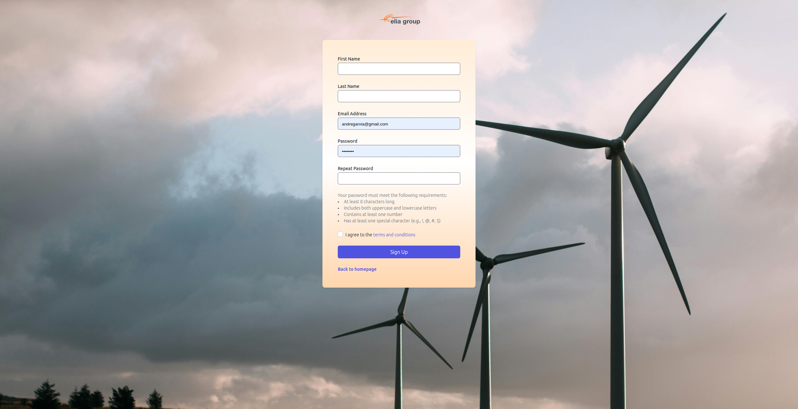
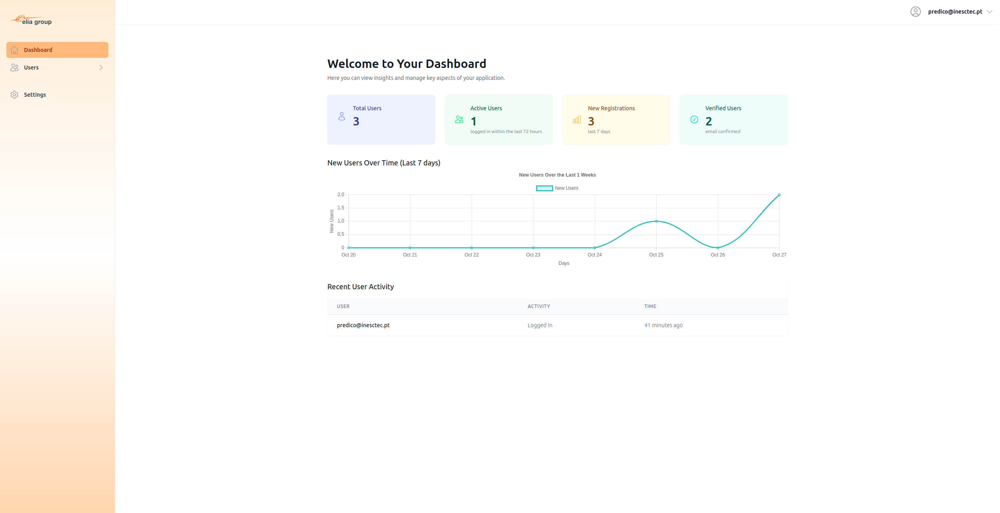

# Steps to Ensure the Frontend Updates 
Clear Docker Caches Thoroughly: Sometimes, even when you run --no-cache, 
Docker might still be using cached layers or containers. To ensure everything is completely rebuilt, you should:

- Remove the Docker volume for the frontend service:

```bash
    docker volume rm collabforecast_frontend_build
```

# Frontend printscreens


### Home Page


### Login Page


### Register Page



### Dashboard
